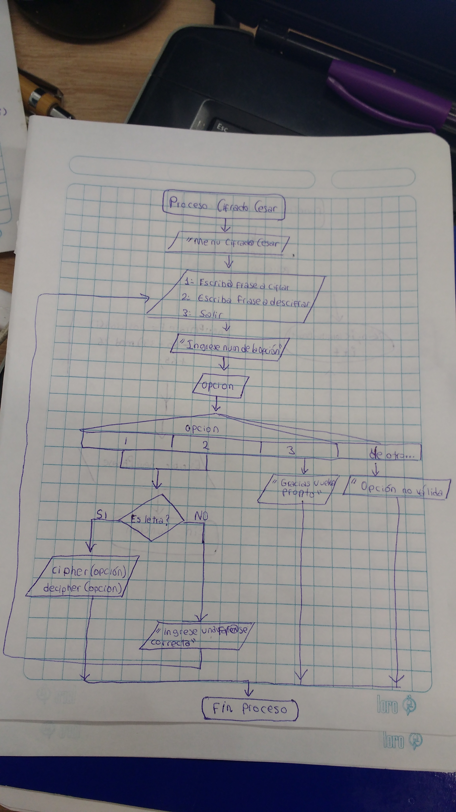

# Cifrado Cesar

## Introduction

En criptografía, el cifrado César, también conocido como cifrado por desplazamiento, código de César o desplazamiento de César, es una de las técnicas de cifrado más simples y más usadas. Es un tipo de cifrado por sustitución en el que una letra en el texto original es reemplazada por otra letra que se encuentra un número fijo de posiciones más adelante en el alfabeto. Por ejemplo, con un desplazamiento de 3, la A sería sustituida por la D (situada 3 lugares a la derecha de la A), la B sería reemplazada por la E, etc.
En este programa usted podrá elegir la opción de desplazamiento, ingresando la frase y la clave.

## Diagramas de Flujo

> Para la solución del programa se presenta el diagrama de flujo.

 * En la imagen el diagrama de flujo corresponde al ingreso y validación de datos ingresados, una vez ingresados se invoca a la función cipher o decipher.

![Cipher][1]  ![Decipher][2]

  [1]: assets/docs/img2.jpg
  [2]: assets/docs/img3.jpg

  * Diagrama de flujo de las funciones de cifrado y decifrado Cesar

## Pseudocodigo
    Cifrado cesar
    1. Ingrese frase a cifrar
    2. Ingrese frase a decifrar
    3. Salir
    Elija una opcion:

    Leer opcion

    Convertir opcion a Ascci

    si((opcion>64 && opcion < 91) || (opcion > 96 && opcion < 193))
        cipher(opcion)
    sino
        Escribir ingrese una opcion valida

    si((opcion>64 && opcion < 91) || (opcion > 96 && opcion < 193))
        decipher(opcion)
    sino
        Escribir ingrese una opcion valida

    funcion cipher(secret){
      Declarar newPhrase = ""
      para( i <- 0; i<longitud(secret); ++){
        convertir secret a Ascii
        newphrase += ((secret(i)-65+33) mod 26 +65)
      }
      Escribir newPhrase
    }

    funcion decipher(secret){
      Declarar newPhrase = ""
      para( i <- 0; i<longitud(secret); ++){
        convertir secret a Ascii
        newphrase += ((secret(i)-65-33 + 26*2 )mod 26 +65)
      }
      Escribir newPhrase
    }
